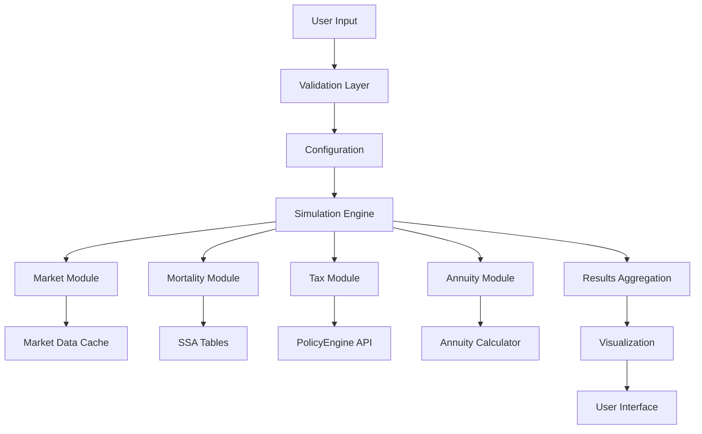

# FinSim Architecture

## Proposed Modular Structure

```
finsim/
├── finsim/                      # Core package
│   ├── __init__.py
│   ├── simulation/              # Simulation engine
│   │   ├── __init__.py
│   │   ├── config.py           # SimulationConfig dataclass
│   │   ├── engine.py           # Core simulation logic
│   │   ├── results.py          # Result dataclasses
│   │   └── strategies.py       # Different simulation strategies
│   │
│   ├── market/                  # Market data and modeling
│   │   ├── __init__.py
│   │   ├── fetcher.py          # Fetch market data (yfinance wrapper)
│   │   ├── models.py           # GBM, GARCH, other market models
│   │   ├── calibration.py      # Calibrate models to historical data
│   │   └── cache.py            # Cache market data locally
│   │
│   ├── mortality/               # Mortality modeling
│   │   ├── __init__.py
│   │   ├── tables.py           # SSA mortality tables
│   │   ├── fetcher.py          # Fetch/update mortality data
│   │   └── models.py           # Life expectancy calculations
│   │
│   ├── tax/                     # Tax calculations
│   │   ├── __init__.py
│   │   ├── calculator.py       # PolicyEngine integration
│   │   ├── strategies.py       # Tax optimization strategies
│   │   └── brackets.py         # Simple tax bracket calculations
│   │
│   ├── annuity/                 # Annuity modeling
│   │   ├── __init__.py
│   │   ├── types.py            # Different annuity types
│   │   ├── calculator.py       # Annuity calculations
│   │   └── optimizer.py        # Optimize annuity selection
│   │
│   ├── data/                    # Static data files
│   │   ├── ssa_mortality.json
│   │   ├── market_params.json  # Default market parameters
│   │   └── tax_brackets.json   # Fallback tax data
│   │
│   └── utils/                   # Utility functions
│       ├── __init__.py
│       ├── validation.py       # Input validation
│       ├── formatting.py       # Number/currency formatting
│       └── logging.py          # Logging configuration
│
├── app/                         # Streamlit application
│   ├── app.py                  # Main Streamlit app (thin layer)
│   ├── pages/                  # Multi-page app structure
│   │   ├── simulation.py       # Simulation page
│   │   ├── analysis.py         # Results analysis page
│   │   └── settings.py         # Configuration page
│   └── components/             # Reusable UI components
│       ├── charts.py           # Plotly chart builders
│       ├── inputs.py           # Input widgets
│       └── results.py          # Result displays
│
├── tests/                       # Test suite
│   ├── unit/                   # Unit tests
│   │   ├── test_simulation/
│   │   ├── test_market/
│   │   ├── test_mortality/
│   │   ├── test_tax/
│   │   └── test_annuity/
│   ├── integration/            # Integration tests
│   │   ├── test_end_to_end.py
│   │   └── test_policyengine.py
│   └── fixtures/               # Test data
│       └── sample_data.py
│
├── scripts/                     # Utility scripts
│   ├── update_mortality.py    # Update SSA tables
│   ├── benchmark.py           # Performance benchmarking
│   └── validate_results.py    # Validate against known cases
│
├── docs/                        # Documentation (Jupyter Book)
│   ├── _config.yml
│   ├── _toc.yml
│   ├── index.md
│   ├── quickstart.md
│   ├── api/                    # API reference
│   │   ├── simulation.md
│   │   ├── market.md
│   │   ├── mortality.md
│   │   └── tax.md
│   ├── tutorials/              # Step-by-step guides
│   │   ├── basic_simulation.md
│   │   ├── annuity_comparison.md
│   │   └── tax_optimization.md
│   └── theory/                 # Mathematical background
│       ├── monte_carlo.md
│       ├── gbm.md
│       └── mortality_models.md
│
├── .github/                     # CI/CD
│   └── workflows/
│       ├── test.yml            # Run tests on PR
│       ├── deploy.yml          # Deploy docs
│       └── update_data.yml     # Scheduled data updates
│
├── pyproject.toml              # Package configuration
├── README.md                   # Project overview
├── LICENSE                     # MIT license
└── CHANGELOG.md               # Version history
```

## Key Design Principles

### 1. Separation of Concerns
- **Core Logic**: All business logic in the `finsim` package
- **UI Layer**: Streamlit app is a thin presentation layer
- **Data Layer**: Separate data fetching from processing
- **Configuration**: Centralized configuration management

### 2. Testability
- Every module has corresponding tests
- Mock external dependencies (market data, PolicyEngine)
- Use dependency injection for flexibility
- TDD approach for new features

### 3. Extensibility
- Plugin architecture for market models
- Strategy pattern for tax calculations
- Easy to add new annuity types
- Configurable data sources

### 4. Performance
- Cache expensive calculations
- Vectorized operations with NumPy
- Lazy loading of data
- Parallel simulation runs

### 5. Maintainability
- Clear module boundaries
- Comprehensive documentation
- Type hints throughout
- Consistent coding style

## Module Responsibilities

### simulation/
- Core Monte Carlo engine
- Configuration management
- Result aggregation
- Simulation strategies (basic, advanced, custom)

### market/
- Fetch historical market data
- Calibrate return models
- Cache data locally
- Support multiple data sources

### mortality/
- Load and manage SSA tables
- Calculate survival probabilities
- Life expectancy calculations
- Support custom mortality tables

### tax/
- Integrate with PolicyEngine-US
- Fallback to simple calculations
- Tax optimization strategies
- State-specific calculations

### annuity/
- Model different annuity types
- Calculate present values
- Compare annuity options
- Optimize annuity selection

## Data Flow



## Testing Strategy

### Unit Tests
- Test each module in isolation
- Mock external dependencies
- Achieve >80% code coverage
- Fast execution (<1 second per test)

### Integration Tests
- Test module interactions
- Use real data where possible
- Verify end-to-end workflows
- Performance benchmarks

### Property-Based Tests
- Use hypothesis for edge cases
- Test mathematical properties
- Verify statistical distributions
- Ensure numerical stability

## Next Steps

1. **Refactor existing code** into the new structure
2. **Write comprehensive tests** for each module  
3. **Create API documentation** with docstrings
4. **Build example notebooks in docs/** for common use cases
5. **Set up CI/CD pipeline** for automated testing
6. **Implement caching layer** for performance
7. **Add configuration management** for flexibility

## Examples and Notebooks

Instead of a separate `examples/` directory, we use:
- **Jupyter notebooks in `docs/`** - Interactive documentation and tutorials
- **Integration tests in `tests/`** - Comprehensive usage examples that also serve as tests
- **Docstring examples** - Small usage snippets in API documentation

This approach ensures examples are always tested and up-to-date.